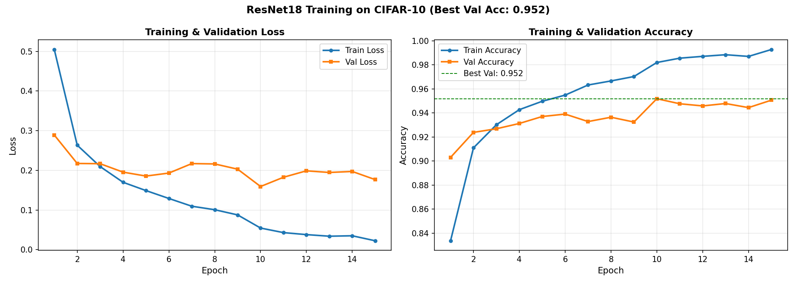
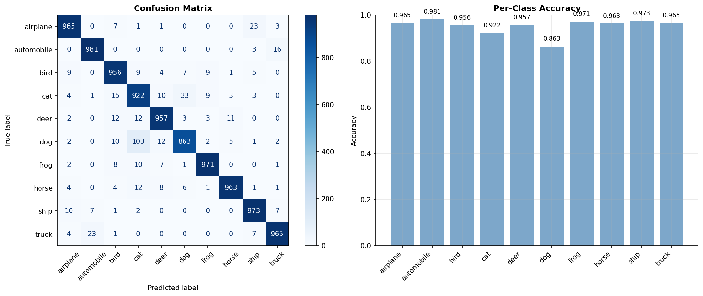

## 📋 Project Overview

This project implements **CIFAR-10 image classification** using transfer learning with ResNet18 architecture. 
The model achieves **95.16% test accuracy**, outperforming the original ResNet paper's benchmark (93-95%).

### Key Features
- 🔄 Transfer learning with pretrained ResNet18
- 🧪 Hyperparameter optimization (learning rate, dropout)
- 📊 Comprehensive evaluation metrics
- 🎯 Benchmark comparison
- 💾 Model saving/loading functionality

## 📈 Results Visualization

### Training Curves

### Confusion Matrix & Per-Class Accuracy

## 🔍 Hyperparameter Search Details

- **Search Space**: 4 combinations
- **Validation Strategy**: 10% of training data
- **Early Stopping**: 3 epochs per combination
- **Best Configuration**:
  - Learning Rate: 1e-4
  - Dropout Rate: 0.3
  - Optimizer: Adam
  - Unfreeze Layers: 2

## 🧪 Hyperparameter Search Results

| Rank | Parameters | Validation Accuracy |
|------|------------|---------------------|
| 1 | lr=0.0001, dropout=0.3 | **92.68%** |
| 2 | lr=0.0001, dropout=0.5 | 92.48% |
| 3 | lr=0.0005, dropout=0.3 | 89.44% |
| 4 | lr=0.0005, dropout=0.5 | 89.42% |

### Search Time
- Total Duration: ~35 minutes
- Hardware: NVIDIA RTX 3060

## 🎨 Data Augmentation

Training transforms applied:
- Random Horizontal Flip (p=0.5)
- Random Rotation (±15°)
- Color Jitter (brightness, contrast, saturation ±0.2)
- Normalization (ImageNet stats)

## 🎯 Benchmark Comparison

| Model | Expected Accuracy | Our Result |
|-------|------------------|------------|
| ResNet18 (paper) | 93-95% | **95.16%** ✅ |